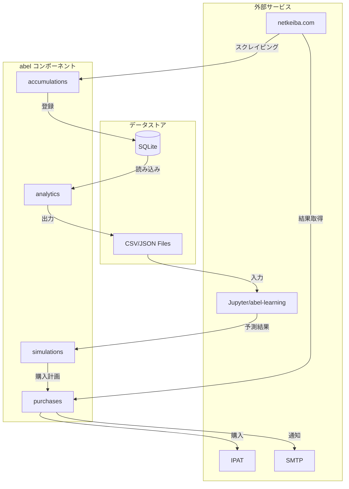
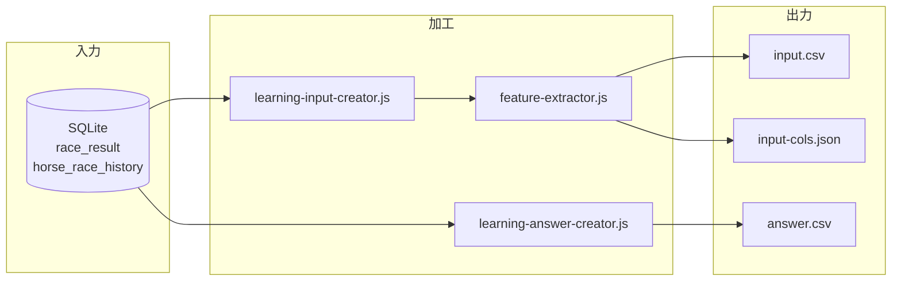
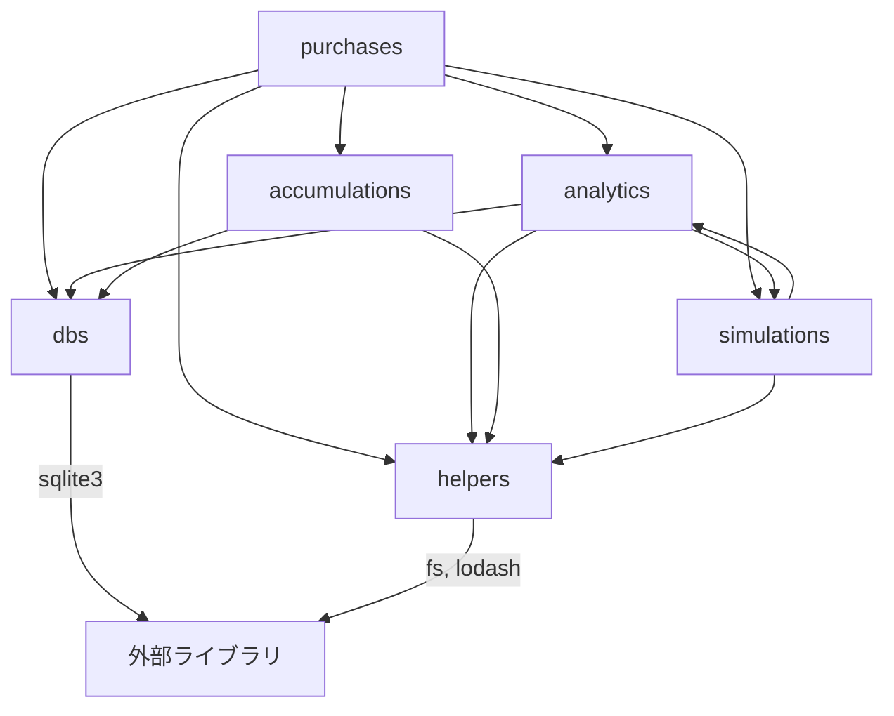

# abel アーキテクチャ

## 技術スタック

| 技術 | 用途 | 備考 |
|------|------|------|
| Node.js | アプリケーション実行基盤 | v12+（v20 で動作確認済み） |
| SQLite | データ永続化 | ローカル DB、セットアップ不要 |
| Puppeteer | ブラウザ自動操作 | IPAT 連携・スクレイピング |
| cheerio | HTML パース | netkeiba.com スクレイピング |
| @jupyterlab/services | Jupyter 連携 | Python ML モデル実行 |
| nodemailer | メール送信 | 購入・結果通知 |

### データストア

| 種別 | 用途 | 保存場所 |
|------|------|----------|
| SQLite | レース情報・結果・購入状態の永続化 | `db/` |
| ファイル (JSON/CSV) | 学習データ・予測結果の中間ファイル | `resources/learnings/`, `resources/simulations/` |

## ディレクトリ構成と責務

| ディレクトリ | 責務 | ファイル数 |
|-------------|------|-----------|
| `src/accumulations/` | データ収集・スクレイピング | 16 |
| `src/analytics/` | 学習データ作成・分析 | 14 + configs/ |
| `src/dbs/` | SQLite アクセス | 4 |
| `src/helpers/` | 共通ユーティリティ | 11 |
| `src/purchases/` | 馬券購入・通知 | 7 |
| `src/simulations/` | 予測・シミュレーション | 7 |

### accumulations（データ収集）

- netkeiba.com からレース情報・結果をスクレイピング
- HTML ダウンロード、パース、DB 登録
- 主要ファイル:
  - `future-race-extractor.js` - 開催予定レース情報抽出
  - `result-race-extractor.js` - レース結果抽出
  - `page-downloader.js` - HTML ダウンロード共通処理

### analytics（学習データ作成）

- DB のレース結果から学習用データを生成
- 特徴量作成、正解データ作成
- 主要ファイル:
  - `learning-input-creator.js` - 学習入力データ作成
  - `learning-answer-creator.js` - 正解データ作成
  - `feature-extractor.js` - 特徴量抽出

### dbs（データベースアクセス）

- SQLite への CRUD 操作
- SQL ファイルの読み込み・実行
- 主要ファイル:
  - `db-accessor.js` - SQL 実行
  - `db-provider.js` - DB 接続管理
  - `sql-reader.js` - SQL ファイル読み込み

### helpers（共通ユーティリティ）

- ファイル操作、データ変換、計算処理
- 他コンポーネントから利用される
- 主要ファイル:
  - `file-helper.js` - ファイル操作
  - `convert-helper.js` - データ変換
  - `html-helper.js` - HTML/puppeteer 操作

### purchases（購入・通知）

- IPAT 連携馬券購入
- メール通知
- 主要ファイル:
  - `ipat-purchase-manager.js` - 購入フロー管理
  - `ipat-connect-purchaser.js` - IPAT 操作
  - `mailer.js` - メール送信
  - `purchase-result-checker.js` - 結果確認

### simulations（予測・シミュレーション）

- Jupyter Notebook 経由の予測実行
- 購入シミュレーション、回収率計算
- 主要ファイル:
  - `predictor.js` - 予測実行
  - `purchaser.js` - 購入シミュレーション
  - `recovery-rate-calculator.js` - 回収率計算

## データフロー



### データの入出力形式

| データ | 形式 | 場所 |
|--------|------|------|
| レース情報 | SQLite テーブル | `db/` |
| 学習入力 | CSV | `resources/learnings/` |
| 正解データ | CSV | `resources/learnings/` |
| 予測結果 | JSON | `resources/simulations/` |
| 購入計画 | JSON | `resources/simulations/sim-result.json` |

## 学習データ生成パイプライン



### 責務境界

- **abel**: 学習データ生成まで
- **abel-learning**: 学習データを受け取り、モデル学習・予測を実行
- インターフェース: CSV ファイル（詳細は [learning-data-contract.md](./learning-data-contract.md)）

## 依存関係

### ディレクトリ間依存

```
accumulations → dbs, helpers
analytics     → dbs, helpers, simulations
purchases     → dbs, helpers, accumulations, analytics, simulations
simulations   → helpers, analytics
dbs           → (外部依存のみ)
helpers       → (外部依存のみ)
```

### 依存関係図



**注**: これは「現行の実態」であり、「あるべき姿」ではない。

## 設計判断とトレードオフ

### 1. Puppeteer によるブラウザ自動操作

- **判断**: IPAT 連携を puppeteer でブラウザ自動操作
- **根拠**: `src/purchases/ipat-connect-purchaser.js` 全体
- **理由**: IPAT に API がないため、ブラウザ操作が必須
- **トレードオフ**:
  - メリット: 人間と同じ操作が可能
  - デメリット: UI 変更に弱い、実行速度が遅い

### 2. Jupyter Notebook 経由の予測実行

- **判断**: 予測処理を Jupyter Notebook 経由で実行
- **根拠**: `src/simulations/predictor.js:30-32`
- **理由**: Python の機械学習ライブラリを活用
- **トレードオフ**:
  - メリット: Python の ML エコシステムを活用可能
  - デメリット: Jupyter の起動・接続管理が必要

### 3. SQLite によるローカル DB

- **判断**: データストアとして SQLite を採用
- **根拠**: `package.json` dependencies
- **理由**: 単体で動作可能、セットアップ不要
- **トレードオフ**:
  - メリット: 依存が少ない、バックアップが容易
  - デメリット: 並行書き込みに制限あり

## 将来の改善余地

**注**: 以下は現状の事実ではなく、将来の改善提案。

1. **依存方向の整理**: purchases が analytics/simulations に直接依存している構造を、イベント駆動やサービス層で分離
2. **設定管理の改善**: 環境変数や .env ファイルへの対応
3. **エラーハンドリングの強化**: 構造化ログ、エラー通知の自動化
4. **テストカバレッジの向上**: 現状 `test/helpers/` のみ
