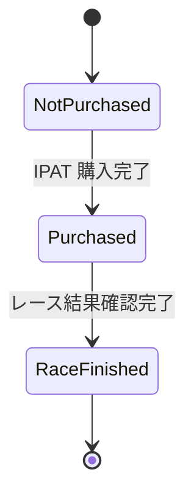

# abel ドメインモデル

## システムの目的

競馬レースの予測と馬券自動購入を行うシステム。

### 目的

- netkeiba.com からレース情報を収集し、機械学習モデルで勝馬を予測する
- IPAT（JRA インターネット投票）連携で馬券を自動購入する
- 購入結果・的中結果をメールで通知する

### 非目的

- 機械学習モデル自体の開発（abel-learning リポジトリの責務）
- レース映像の分析
- 他の公営競技（競輪・競艇等）への対応

## ドメイン概念と関係

### 主要エンティティ

| エンティティ | 説明 | 対応テーブル |
|-------------|------|-------------|
| レース結果 (RaceResult) | 過去のレース情報・結果 | `race_result` |
| 予定レース (RaceFuture) | 開催予定のレース情報 | `race_future` |
| 馬出走履歴 (HorseRaceHistory) | 馬ごとの出走履歴 | `horse_race_history` |
| シミュレーション結果 (SimulationResult) | 予測・シミュレーション結果 | `simulation_result` |
| 購入 (Purchase) | 馬券購入の状態管理 | `purchase` |

### エンティティ間の関係

- **レース結果** は複数の **馬出走履歴** を持つ（1レースに複数馬が出走）
- **予定レース** は複数の **馬出走履歴** を持つ
- **シミュレーション結果** は予測に基づく購入計画を保持
- **購入** はレース単位で馬券購入の状態を管理

## 業務フロー

### 日次運用フロー

1. **予測フェーズ**: 当日のレース情報を取得し、機械学習モデルで予測を実行
2. **購入フェーズ**: 予測結果に基づき、条件を満たすレースの馬券を IPAT 経由で購入
3. **結果確認フェーズ**: レース終了後、結果を取得し的中判定・収支計算を行う
4. **通知フェーズ**: 購入時・結果確認時にメールで通知

## 業務ルール・制約

### 購入に関する制約

- 購入は IPAT 連携のみ（現金購入・他サービス非対応）
- 購入状態は 3 段階で管理（根拠: `src/consts.js:10-23`）

### 予測に関する制約

- 予測は Jupyter Notebook 経由でのみ実行
- 予測モデルは abel-learning で事前に学習済みであることが前提

### リトライに関する制約

- 購入・結果確認処理には `config.ipat.maxRetryCount` によるリトライ機構あり
- 対象: 購入処理（`ipat-purchase-manager.js:59`）、結果確認処理（`purchase-result-checker.js:50`）

### 部分失敗時の扱い

- 複数レースの購入で一部失敗した場合、成功分は DB に記録
- 失敗分はリトライ後、手動確認が必要

## 状態遷移

### 購入状態

```javascript
// src/consts.js:10-23
PurchaseStatus: {
  NotPurchased: 0,  // 未購入
  Purchased: 1,     // 購入完了
  RaceFinished: 2   // レース終了
}
```



- **NotPurchased → Purchased**: IPAT 連携で馬券購入が完了した時点で遷移
- **Purchased → RaceFinished**: レース終了後、結果取得・的中判定が完了した時点で遷移
- 購入処理の冪等性: 同一レースの二重購入を防止（`hasPurchased` チェック）

## データ永続化（DB 設計）

### 主要テーブル

| テーブル名 | 用途 | 主キー |
|-----------|------|--------|
| `race_result` | レース結果 | `race_id` |
| `race_future` | 開催予定レース | `race_id` |
| `horse_race_history` | 馬の出走履歴 | `horse_id`, `race_id` |
| `simulation_result` | シミュレーション結果 | - |
| `purchase` | 購入状態管理 | `race_id` |

### 主要ビュー

| ビュー名 | 用途 |
|---------|------|
| `view_result_race_history` | 結果レースと履歴の結合 |
| `view_future_race_history` | 予定レースと履歴の結合 |
| `view_result_post_history` | 事後分析用ビュー |

### DDL 参照

詳細は `resources/sqls/create_*.sql` を参照:

- [create_race_result.sql](../resources/sqls/create_race_result.sql)
- [create_race_future.sql](../resources/sqls/create_race_future.sql)
- [create_horse_race_history.sql](../resources/sqls/create_horse_race_history.sql)
- [create_simulation_result.sql](../resources/sqls/create_simulation_result.sql)
- [create_purchase.sql](../resources/sqls/create_purchase.sql)
